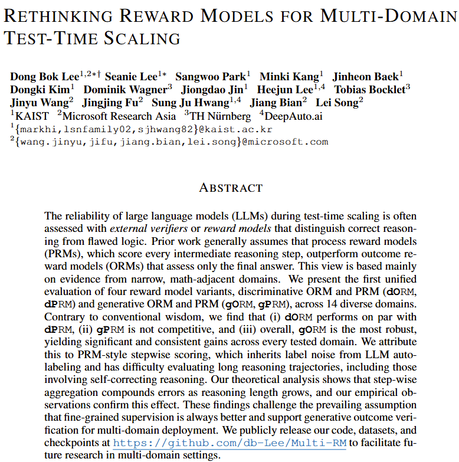

# Rethinking Reward Models for Multi-Domain Test-Time Scaling
[](https://arxiv.org/abs/ARXIV_ID)

This repository contains the codebase for our paper, "**Rethinking Reward Models for Multi-Domain Test-Time Scaling**."

---

## Abstract

<p align="center">
  <a href="https://arxiv.org/abs/25xx.xxxxx">
    
  </a>
</p>

---

## Quick Start
```
conda create -n multi-rm python=3.10.14
conda activate multi-rm
pip install -r requirements.txt
pip install flash-attn --no-build-isolation
```

## Synthetic Verfication Rationale Generation for gORM/gPRM (optional)

```python
# TASK_TYPE can be one of:
# gORM / gPRM
TASK_TYPE=[choose_one_above]

# generate data
python -m data_generation.generate_data \
  --output_dir [OUTPUT_DIR] \
  --task_type ${TASK_TYPE}

# preprocess data
python -m data_generation.preprocess_data \
  --output_dir [OUTPUT_DIR] \
  --task_type ${TASK_TYPE}

# shorten critique (optional)
python -m data_generation.shorten_critique \
  --output_dir [OUTPUT_DIR] \
  --task_type ${TASK_TYPE}
```

## Training

```python
# Training dORM / dPRM
# Use the appropriate config file:
# ./configs/dORM-14B.yaml
# ./configs/dPRM-14B.yaml
# ./configs/dORM-8B.yaml
# ./configs/dPRM-8B.yaml

accelerate launch -m discriminative.train \
  --config ./configs/dORM-14B.yaml \
  --output_dir ./[TRAINING_RESULTS]/dORM-14B \
  --per_device_batch_size 4 \
  --category all

# Training gORM / gPRM
# Use the appropriate config file:
# ./configs/gORM-14B.yaml
# ./configs/gPRM-14B.yaml
# ./configs/gORM-8B.yaml
# ./configs/gPRM-8B.yaml

accelerate launch -m generative.train \
  --config ./configs/gORM-14B.yaml \
  --output_dir ./[TRAINING_RESULTS]/gORM-14B \
  --per_device_batch_size 4 \
  --category all
```

## Inference (reward)

```python
# TEST can be one of:
# test (CoTs generated by Llama3.1-8B-Instruct)
# test_smollm (CoTs generated by Smollm3)
# test_qwen (CoTs generated by Qwen2.5-7B-Instruct)
# test_gemma (CoTs generated by gemma2-9B-it)
# test_llama (CoTs generated by Llama3.1-80B-Instruct)

# Inference for dORM / dPRM
# Use the appropriate model checkpoint:
# dongboklee/dORM-14B
# dongboklee/dPRM-14B
# or use your own trained models

python -m discriminative.get_reward \
  --data_path dongboklee/[TEST] \
  --model_id dongboklee/dORM-14B \
  --output_dir ./[REWARD_RESULTS]/dORM-14B-[TEST] \
  --per_device_batch_size 8 \
  --category all

# Inference for gORM / gPRM
# Use the appropriate model checkpoint:
# dongboklee/gORM-14B-merged, TASK_TYPE=gORM
# dongboklee/gPRM-14B-merged, TASK_TYPE=gPRM

python -m generative.get_reward \
  --data_path dongboklee/[TEST] \
  --model_id dongboklee/gORM-14B-merged \
  --output_dir ./[REWARD_RESULTS]/gORM-14B-[TEST] \
  --task_type gORM \
  --category all

# Inference for gORM / gPRM (for your own trained models)
# Use the appropriate model checkpoint:
# [LOCAL_DIR]/gORM-14B, TASK_TYPE=gORM
# [LOCAL_DIR]/gPRM-14B, TASK_TYPE=gPRM

# Merge LoRA for vLLM inference
python -m generative.merge_lora \
  --input_dir [LOCAL_DIR]/gORM-14B # saved to [LOCAL_DIR]/gORM-14B/tmp

python -m generative.get_reward \
  --data_path dongboklee/[TEST] \
  --model_id [LOCAL_DIR]/gORM-14B/tmp \
  --output_dir ./[REWARD_RESULTS]/gORM-14B-[TEST] \
  --task_type gORM \
  --category all
```

## Evaluation
```python
# TEST can be one of:
# test (CoTs generated by Llama3.1-8B-Instruct)
# test_smollm (CoTs generated by Smollm3)
# test_qwen (CoTs generated by Qwen2.5-7B-Instruct)
# test_gemma (CoTs generated by gemma2-9B-it)
# test_llama (CoTs generated by Llama3.1-80B-Instruct)
TEST=[choose_one_above]

# Or use your own reward dirs instead of HF hubs:
# [MODEL_NAME]/[TEST]/[CATEGORY]_reward.json
python -m evaluation.evaluate \
  --data_path dongboklee/${TEST} \
  --output_dir [OUTPUT_DIR] \
  --reward_dirs \
    dongboklee/dORM-14B-${TEST} \
    dongboklee/dPRM-14B-${TEST} \
    dongboklee/gORM-14B-${TEST} \
    dongboklee/gPRM-14B-${TEST} \  
  --model_names dORM-14B dPRM-14B gORM-14B gPRM-14B \
  --strategies last min mean mean \
  --num_runs 100

# CSV_FILE can be one of:
# [OUTPUT_DIR_FROM_ABOVE]/best_of_n.csv
# [OUTPUT_DIR_FROM_ABOVE]/weighted_vote.csv
CSV_FILE=[choose_one_above]

# [OUTPUT_FILE_PREFIX]=example
# -> example_legend.png / example_legend.pdf
# -> example.png / example.pdf
python -m evaluation.plot \
  --input_file ${CSV_FILE} \
  --output_file [OUTPUT_FILE_PREFIX]
```
---

## Assets

Please find the assets of this repo below, including training and test datasets, model checkpoints, and rewards obtained by the four reward model variants.

### Datasets

| Name | Description |
|:---|:---|
| [train](https://huggingface.co/datasets/dongboklee/train) | multi-domain training dataset for dORM/dPRM (mostly adapted from [VersaPRM](https://github.com/UW-Madison-Lee-Lab/VersaPRM)). |
| [train_gORM](https://huggingface.co/datasets/dongboklee/train_gORM) | multi-domain training dataset for gORM generated by [QwQ-32B](https://huggingface.co/Qwen/QwQ-32B). |
| [train_gPRM](https://huggingface.co/datasets/dongboklee/train_gPRM) | multi-domain training dataset for gPRM generated by [QwQ-32B](https://huggingface.co/Qwen/QwQ-32B). |
| [test](https://huggingface.co/datasets/dongboklee/test) | multi-domain test dataset with CoTs (N=128) generated by [Llama3.1-8B-Instruct](https://huggingface.co/meta-llama/Llama-3.1-8B-Instruct) (mostly adapted from [VersaPRM](https://github.com/UW-Madison-Lee-Lab/VersaPRM)). |
| [test_smollm](https://huggingface.co/datasets/dongboklee/test_smollm) | multi-domain test dataset with CoTs (N=16) generated by [SmolLM3-3B](https://huggingface.co/HuggingFaceTB/SmolLM3-3B). |
| [test_qwen](https://huggingface.co/datasets/dongboklee/test_qwen) | multi-domain test dataset with CoTs (N=16) generated by [Qwen2.5-7B-Instruct](https://huggingface.co/Qwen/Qwen2.5-7B-Instruct). |
| [test_gemma](https://huggingface.co/datasets/dongboklee/test_gemma) | multi-domain test dataset with CoTs (N=16) generated by [gemma-2-9b-it](https://huggingface.co/google/gemma-2-9b-it). |
| [test_llama](https://huggingface.co/datasets/dongboklee/test_llama) | multi-domain test dataset with CoTs (N=16) generated by [Llama-3.1-70B-Instruct](https://huggingface.co/meta-llama/Llama-3.1-70B-Instruct). |


### Model Checkpoints

| Name | Backbone | Trained On | LoRA-merged version |
|:---|:---|:---|:---|
| [dORM-14B](https://huggingface.co/dongboklee/dORM-14B) | [14B backbone](https://huggingface.co/deepseek-ai/DeepSeek-R1-Distill-Qwen-14B) | [train](https://huggingface.co/datasets/dongboklee/train) | — |
| [dPRM-14B](https://huggingface.co/dongboklee/dPRM-14B) | [14B backbone](https://huggingface.co/deepseek-ai/DeepSeek-R1-Distill-Qwen-14B) | [train](https://huggingface.co/datasets/dongboklee/train) | — |
| [gORM-14B](https://huggingface.co/dongboklee/gORM-14B) | [14B backbone](https://huggingface.co/deepseek-ai/DeepSeek-R1-Distill-Qwen-14B) | [train_gORM](https://huggingface.co/datasets/dongboklee/train_gORM) | [gORM-14B-merged](https://huggingface.co/dongboklee/gORM-14B-merged) |
| [gPRM-14B](https://huggingface.co/dongboklee/gPRM-14B) | [14B backbone](https://huggingface.co/deepseek-ai/DeepSeek-R1-Distill-Qwen-14B) | [train_gPRM](https://huggingface.co/datasets/dongboklee/train_gPRM) | [gPRM-14B-merged](https://huggingface.co/dongboklee/gPRM-14B-merged) |
| [dORM-8B](https://huggingface.co/dongboklee/dORM-8B) | [8B backbone](https://huggingface.co/deepseek-ai/DeepSeek-R1-Distill-Llama-8B) | [train](https://huggingface.co/datasets/dongboklee/train) | — |
| [dPRM-8B](https://huggingface.co/dongboklee/dPRM-8B) | [8B backbone](https://huggingface.co/deepseek-ai/DeepSeek-R1-Distill-Llama-8B) | [train](https://huggingface.co/datasets/train) | — |
| [gORM-8B](https://huggingface.co/dongboklee/gORM-8B) | [8B backbone](https://huggingface.co/deepseek-ai/DeepSeek-R1-Distill-Llama-8B) | [train_gORM](https://huggingface.co/datasets/dongboklee/train_gORM) | [gORM-8B-merged](https://huggingface.co/dongboklee/gORM-8B-merged) |
| [gPRM-8B](https://huggingface.co/dongboklee/gPRM-8B) | [8B backbone](https://huggingface.co/deepseek-ai/DeepSeek-R1-Distill-Llama-8B) | [train_gPRM](https://huggingface.co/datasets/dongboklee/train_gPRM) | [gPRM-8B-merged](https://huggingface.co/dongboklee/gPRM-8B-merged) |


### Rewards on Datasets by Model

| Name | Model | Dataset |
|:---|:---|:---|
| [dORM-14B-test](https://huggingface.co/datasets/dongboklee/dORM-14B-test) | [dORM-14B](https://huggingface.co/dongboklee/dORM-14B) | [test](https://huggingface.co/datasets/dongboklee/test) |
| [dORM-8B-test](https://huggingface.co/datasets/dongboklee/dORM-8B-test) | [dORM-8B](https://huggingface.co/dongboklee/dORM-8B) | [test](https://huggingface.co/datasets/dongboklee/test) |
| [dORM-14B-test_smollm](https://huggingface.co/datasets/dongboklee/dORM-14B-test_smollm) | [dORM-14B](https://huggingface.co/dongboklee/dORM-14B) | [test_smollm](https://huggingface.co/datasets/dongboklee/test_smollm) |
| [dORM-14B-test_qwen](https://huggingface.co/datasets/dongboklee/dORM-14B-test_qwen) | [dORM-14B](https://huggingface.co/dongboklee/dORM-14B) | [test_qwen](https://huggingface.co/datasets/dongboklee/test_qwen) |
| [dORM-14B-test_gemma](https://huggingface.co/datasets/dongboklee/dORM-14B-test_gemma) | [dORM-14B](https://huggingface.co/dongboklee/dORM-14B) | [test_gemma](https://huggingface.co/datasets/dongboklee/test_gemma) |
| [dORM-14B-test_llama](https://huggingface.co/datasets/dongboklee/dORM-14B-test_llama) | [dORM-14B](https://huggingface.co/dongboklee/dORM-14B) | [test_llama](https://huggingface.co/datasets/dongboklee/test_llama) |
| [dPRM-14B-test](https://huggingface.co/datasets/dongboklee/dPRM-14B-test) | [dPRM-14B](https://huggingface.co/dongboklee/dPRM-14B) | [test](https://huggingface.co/datasets/dongboklee/test) |
| [dPRM-8B-test](https://huggingface.co/datasets/dongboklee/dPRM-8B-test) | [dPRM-8B](https://huggingface.co/dongboklee/dPRM-8B) | [test](https://huggingface.co/datasets/dongboklee/test) |
| [dPRM-14B-test_smollm](https://huggingface.co/datasets/dongboklee/dPRM-14B-test_smollm) | [dPRM-14B](https://huggingface.co/dongboklee/dPRM-14B) | [test_smollm](https://huggingface.co/datasets/dongboklee/test_smollm) |
| [dPRM-14B-test_qwen](https://huggingface.co/datasets/dongboklee/dPRM-14B-test_qwen) | [dPRM-14B](https://huggingface.co/dongboklee/dPRM-14B) | [test_qwen](https://huggingface.co/datasets/dongboklee/test_qwen) |
| [dPRM-14B-test_gemma](https://huggingface.co/datasets/dongboklee/dPRM-14B-test_gemma) | [dPRM-14B](https://huggingface.co/dongboklee/dPRM-14B) | [test_gemma](https://huggingface.co/datasets/dongboklee/test_gemma) |
| [dPRM-14B-test_llama](https://huggingface.co/datasets/dongboklee/dPRM-14B-test_llama) | [dPRM-14B](https://huggingface.co/dongboklee/dPRM-14B) | [test_llama](https://huggingface.co/datasets/dongboklee/test_llama) |
| [gORM-14B-test](https://huggingface.co/datasets/dongboklee/gORM-14B-test) | [gORM-14B-merged](https://huggingface.co/dongboklee/gORM-14B-merged) | [test](https://huggingface.co/datasets/dongboklee/test) |
| [gORM-8B-test](https://huggingface.co/datasets/dongboklee/gORM-8B-test) | [gORM-8B-merged](https://huggingface.co/dongboklee/gORM-8B-merged) | [test](https://huggingface.co/datasets/dongboklee/test) |
| [gORM-14B-test_smollm](https://huggingface.co/datasets/dongboklee/gORM-14B-test_smollm) | [gORM-14B-merged](https://huggingface.co/dongboklee/gORM-14B-merged) | [test_smollm](https://huggingface.co/datasets/dongboklee/test_smollm) |
| [gORM-14B-test_qwen](https://huggingface.co/datasets/dongboklee/gORM-14B-test_qwen) | [gORM-14B-merged](https://huggingface.co/dongboklee/gORM-14B-merged) | [test_qwen](https://huggingface.co/datasets/dongboklee/test_qwen) |
| [gORM-14B-test_gemma](https://huggingface.co/datasets/dongboklee/gORM-14B-test_gemma) | [gORM-14B-merged](https://huggingface.co/dongboklee/gORM-14B-merged) | [test_gemma](https://huggingface.co/datasets/dongboklee/test_gemma) |
| [gORM-14B-test_llama](https://huggingface.co/datasets/dongboklee/gORM-14B-test_llama) | [gORM-14B-merged](https://huggingface.co/dongboklee/gORM-14B-merged) | [test_llama](https://huggingface.co/datasets/dongboklee/test_llama) |
| [gPRM-14B-test](https://huggingface.co/datasets/dongboklee/gPRM-14B-test) | [gPRM-14B-merged](https://huggingface.co/dongboklee/gPRM-14B-merged) | [test](https://huggingface.co/datasets/dongboklee/test) |
| [gPRM-8B-test](https://huggingface.co/datasets/dongboklee/gPRM-8B-test) | [gPRM-8B-merged](https://huggingface.co/dongboklee/gPRM-8B-merged) | [test](https://huggingface.co/datasets/dongboklee/test) |
| [gPRM-14B-test_smollm](https://huggingface.co/datasets/dongboklee/gPRM-14B-test_smollm) | [gPRM-14B-merged](https://huggingface.co/dongboklee/gPRM-14B-merged) | [test_smollm](https://huggingface.co/datasets/dongboklee/test_smollm) |
| [gPRM-14B-test_qwen](https://huggingface.co/datasets/dongboklee/gPRM-14B-test_qwen) | [gPRM-14B-merged](https://huggingface.co/dongboklee/gPRM-14B-merged) | [test_qwen](https://huggingface.co/datasets/dongboklee/test_qwen) |
| [gPRM-14B-test_gemma](https://huggingface.co/datasets/dongboklee/gPRM-14B-test_gemma) | [gPRM-14B-merged](https://huggingface.co/dongboklee/gPRM-14B-merged) | [test_gemma](https://huggingface.co/datasets/dongboklee/test_gemma) |
| [gPRM-14B-test_llama](https://huggingface.co/datasets/dongboklee/gPRM-14B-test_llama) | [gPRM-14B-merged](https://huggingface.co/dongboklee/gPRM-14B-merged) | [test_llama](https://huggingface.co/datasets/dongboklee/test_llama) |

---

## Citation
```
@article{multi-rm,
  title   = {Rethinking Reward Models for Multi-Domain Test-Time Scaling},
  author  = {Lee, Dong Bok and Lee, Seanie and Park, Sangwoo and Kang, Minki and Baek, Jinheon and Kim, Dongki and Wagner, Dominik and Jin, Jiongdao and Lee, Heejun and Bocklet, Tobias and Wang, Jinyu and Fu, Jingjing and Hwang, Sung Ju and Bian, Jiang and Song, Lei},
  journal = {arXiv preprint arXiv:25xx.xxxxx},
  year    = {2025}
}

```
