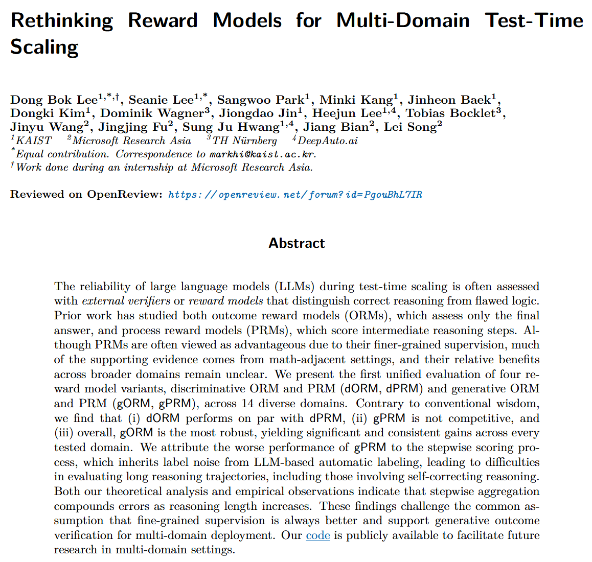

# Rethinking Reward Models for Multi-Domain Test-Time Scaling
[](https://arxiv.org/abs/2510.00492)

This repository contains the codebase for our paper, "**Rethinking Reward Models for Multi-Domain Test-Time Scaling**."

---

## Abstract

<p align="center">
  <a href="https://arxiv.org/abs/2510.00492">
    
  </a>
</p>

---

## Quick Start
```
conda create -n multi-rm python=3.10.14
conda activate multi-rm
pip install -r requirements.txt
pip install flash-attn --no-build-isolation
```

## Synthetic Verfication Rationale Generation for gORM/gPRM (optional)

```python
# TASK_TYPE can be one of:
# gORM / gPRM
TASK_TYPE=[choose_one_above]

# generate data
python -m data_generation.generate_data \
  --output_dir [OUTPUT_DIR] \
  --task_type ${TASK_TYPE}

# preprocess data
python -m data_generation.preprocess_data \
  --output_dir [OUTPUT_DIR] \
  --task_type ${TASK_TYPE}

# shorten critique (optional)
python -m data_generation.shorten_critique \
  --output_dir [OUTPUT_DIR] \
  --task_type ${TASK_TYPE}
```

## Training

```python
# Training dORM / dPRM
# Use the appropriate config file:
# ./configs/dORM-14B.yaml
# ./configs/dPRM-14B.yaml
# ./configs/dORM-8B.yaml
# ./configs/dPRM-8B.yaml
# ./configs/dORM-qwen.yaml
# ./configs/dPRM-qwen.yaml

accelerate launch -m discriminative.train \
  --config ./configs/dORM-14B.yaml \
  --output_dir ./[TRAINING_RESULTS]/dORM-14B \
  --per_device_batch_size 4 \
  --category all

# Training gORM / gPRM
# Use the appropriate config file:
# ./configs/gORM-14B.yaml
# ./configs/gPRM-14B.yaml
# ./configs/gORM-8B.yaml
# ./configs/gPRM-8B.yaml
# ./configs/gORM-qwen.yaml
# ./configs/gPRM-qwen.yaml

accelerate launch -m generative.train \
  --config ./configs/gORM-14B.yaml \
  --output_dir ./[TRAINING_RESULTS]/gORM-14B \
  --per_device_batch_size 4 \
  --category all
```

## Inference (reward)

```python
# DATASET_NAME can be one of:
# MMLU-Pro / GPQA-diamond / MedQA / LEXam
#
# MODEL_NAME is the model whose CoTs the test set contains:
# MMLU-Pro / GPQA-diamond: Llama-3.1-8B-Instruct, SmolLM3-3B, Qwen2.5-7B-Instruct, gemma-2-9b-it, Llama-3.1-70B-Instruct
# MedQA / LEXam: SmolLM3-3B, gemma-2-9b-it
DATASET_NAME=[choose_one_above]
MODEL_NAME=[choose_one_above]
TEST=${DATASET_NAME}_${MODEL_NAME}_test

# Inference for dORM / dPRM
# Use the appropriate model checkpoint:
# dongboklee/dORM-14B
# dongboklee/dPRM-14B
# or use your own trained models

python -m discriminative.get_reward \
  --data_path dongboklee/${TEST} \
  --model_id dongboklee/dORM-14B \
  --output_dir ./[REWARD_RESULTS]/dORM-14B-${TEST} \
  --per_device_batch_size 8 \
  --category all

# Inference for gORM / gPRM
# Use the appropriate model checkpoint (a LoRA adapter):
# dongboklee/gORM-14B, TASK_TYPE=gORM
# dongboklee/gPRM-14B, TASK_TYPE=gPRM
# or use your own trained models: [LOCAL_DIR]/gORM-14B, [LOCAL_DIR]/gPRM-14B

python -m generative.get_reward \
  --data_path dongboklee/${TEST} \
  --model_id dongboklee/gORM-14B \
  --output_dir ./[REWARD_RESULTS]/gORM-14B-${TEST} \
  --task_type gORM \
  --category all
```

## Evaluation
```python
# DATASET_NAME can be one of:
# MMLU-Pro / GPQA-diamond / MedQA / LEXam
#
# MODEL_NAME is the model whose CoTs the test set contains:
# MMLU-Pro / GPQA-diamond: Llama-3.1-8B-Instruct, SmolLM3-3B, Qwen2.5-7B-Instruct, gemma-2-9b-it, Llama-3.1-70B-Instruct
# MedQA / LEXam: SmolLM3-3B, gemma-2-9b-it
DATASET_NAME=[choose_one_above]
MODEL_NAME=[choose_one_above]
TEST=${DATASET_NAME}_${MODEL_NAME}_test

# Or use your own reward dirs instead of HF hubs:
# [REWARD_MODEL_NAME]/[TEST]/[CATEGORY]_reward.json
#
# Swap -14B for -8B or -qwen (e.g. dORM-8B, dORM-qwen) to evaluate the other backbones
python -m evaluation.evaluate \
  --data_path dongboklee/${TEST} \
  --output_dir [OUTPUT_DIR] \
  --reward_dirs \
    dongboklee/dORM-14B-${TEST} \
    dongboklee/dPRM-14B-${TEST} \
    dongboklee/gORM-14B-${TEST} \
    dongboklee/gPRM-14B-${TEST} \  
  --model_names dORM-14B dPRM-14B gORM-14B gPRM-14B \
  --strategies last min mean mean \
  --num_runs 100

# CSV_FILE can be one of:
# [OUTPUT_DIR_FROM_ABOVE]/best_of_n.csv
# [OUTPUT_DIR_FROM_ABOVE]/weighted_vote.csv
CSV_FILE=[choose_one_above]

# [OUTPUT_FILE_PREFIX]=example
# -> example_legend.png / example_legend.pdf
# -> example.png / example.pdf
python -m evaluation.plot \
  --input_file ${CSV_FILE} \
  --output_file [OUTPUT_FILE_PREFIX]
```
---

## Assets

Please find the assets of this repo below, including training and test datasets and model checkpoints.

### Training datasets

| Name | Description |
|:---|:---|
| [MMLU-Pro_Llama-3.1-8B-Instruct_train](https://huggingface.co/datasets/dongboklee/MMLU-Pro_Llama-3.1-8B-Instruct_train) | MMLU-Pro training dataset for dORM/dPRM, adapted from [VersaPRM](https://github.com/UW-Madison-Lee-Lab/VersaPRM). |
| [MMLU-Pro_Llama-3.1-8B-Instruct_gORM_train](https://huggingface.co/datasets/dongboklee/MMLU-Pro_Llama-3.1-8B-Instruct_gORM_train) | MMLU-Pro training dataset for gORM. |
| [MMLU-Pro_Llama-3.1-8B-Instruct_gPRM_train](https://huggingface.co/datasets/dongboklee/MMLU-Pro_Llama-3.1-8B-Instruct_gPRM_train) | MMLU-Pro training dataset for gPRM. |

### Test datasets

| Name | Description |
|:---|:---|
| [MMLU-Pro_Llama-3.1-8B-Instruct_test](https://huggingface.co/datasets/dongboklee/MMLU-Pro_Llama-3.1-8B-Instruct_test) | MMLU-Pro test dataset generated by [Llama-3.1-8B-Instruct](https://huggingface.co/meta-llama/Llama-3.1-8B-Instruct), adapted from [VersaPRM](https://github.com/UW-Madison-Lee-Lab/VersaPRM). |
| [MMLU-Pro_SmolLM3-3B_test](https://huggingface.co/datasets/dongboklee/MMLU-Pro_SmolLM3-3B_test) | MMLU-Pro test dataset generated by [SmolLM3-3B](https://huggingface.co/HuggingFaceTB/SmolLM3-3B). |
| [MMLU-Pro_Qwen2.5-7B-Instruct_test](https://huggingface.co/datasets/dongboklee/MMLU-Pro_Qwen2.5-7B-Instruct_test) | MMLU-Pro test dataset generated by [Qwen2.5-7B-Instruct](https://huggingface.co/Qwen/Qwen2.5-7B-Instruct). |
| [MMLU-Pro_gemma-2-9b-it_test](https://huggingface.co/datasets/dongboklee/MMLU-Pro_gemma-2-9b-it_test) | MMLU-Pro test dataset generated by [gemma-2-9b-it](https://huggingface.co/google/gemma-2-9b-it). |
| [MMLU-Pro_Llama-3.1-70B-Instruct_test](https://huggingface.co/datasets/dongboklee/MMLU-Pro_Llama-3.1-70B-Instruct_test) | MMLU-Pro test dataset generated by [Llama-3.1-70B-Instruct](https://huggingface.co/meta-llama/Llama-3.1-70B-Instruct). |
| [GPQA-diamond_Llama-3.1-8B-Instruct_test](https://huggingface.co/datasets/dongboklee/GPQA-diamond_Llama-3.1-8B-Instruct_test) | GPQA-diamond test dataset generated by [Llama-3.1-8B-Instruct](https://huggingface.co/meta-llama/Llama-3.1-8B-Instruct). |
| [GPQA-diamond_SmolLM3-3B_test](https://huggingface.co/datasets/dongboklee/GPQA-diamond_SmolLM3-3B_test) | GPQA-diamond test dataset generated by [SmolLM3-3B](https://huggingface.co/HuggingFaceTB/SmolLM3-3B). |
| [GPQA-diamond_Qwen2.5-7B-Instruct_test](https://huggingface.co/datasets/dongboklee/GPQA-diamond_Qwen2.5-7B-Instruct_test) | GPQA-diamond test dataset generated by [Qwen2.5-7B-Instruct](https://huggingface.co/Qwen/Qwen2.5-7B-Instruct). |
| [GPQA-diamond_gemma-2-9b-it_test](https://huggingface.co/datasets/dongboklee/GPQA-diamond_gemma-2-9b-it_test) | GPQA-diamond test dataset generated by [gemma-2-9b-it](https://huggingface.co/google/gemma-2-9b-it). |
| [GPQA-diamond_Llama-3.1-70B-Instruct_test](https://huggingface.co/datasets/dongboklee/GPQA-diamond_Llama-3.1-70B-Instruct_test) | GPQA-diamond test dataset generated by [Llama-3.1-70B-Instruct](https://huggingface.co/meta-llama/Llama-3.1-70B-Instruct). |
| [MedQA_SmolLM3-3B_test](https://huggingface.co/datasets/dongboklee/MedQA_SmolLM3-3B_test) | MedQA test dataset generated by [SmolLM3-3B](https://huggingface.co/HuggingFaceTB/SmolLM3-3B). |
| [MedQA_gemma-2-9b-it_test](https://huggingface.co/datasets/dongboklee/MedQA_gemma-2-9b-it_test) | MedQA test dataset generated by [gemma-2-9b-it](https://huggingface.co/google/gemma-2-9b-it). |
| [LEXam_SmolLM3-3B_test](https://huggingface.co/datasets/dongboklee/LEXam_SmolLM3-3B_test) | LEXam test dataset generated by [SmolLM3-3B](https://huggingface.co/HuggingFaceTB/SmolLM3-3B). |
| [LEXam_gemma-2-9b-it_test](https://huggingface.co/datasets/dongboklee/LEXam_gemma-2-9b-it_test) | LEXam test dataset generated by [gemma-2-9b-it](https://huggingface.co/google/gemma-2-9b-it). |

### Model Checkpoints

| Reward model | Reward backbone | Training data |
|:---|:---|:---|
| [dORM-14B](https://huggingface.co/dongboklee/dORM-14B) / [-2](https://huggingface.co/dongboklee/dORM-14B-2) / [-3](https://huggingface.co/dongboklee/dORM-14B-3) / [-4](https://huggingface.co/dongboklee/dORM-14B-4) / [-5](https://huggingface.co/dongboklee/dORM-14B-5) | [DeepSeek-R1-Distill-Qwen-14B](https://huggingface.co/deepseek-ai/DeepSeek-R1-Distill-Qwen-14B) | [MMLU-Pro_Llama-3.1-8B-Instruct_train](https://huggingface.co/datasets/dongboklee/MMLU-Pro_Llama-3.1-8B-Instruct_train) |
| [dPRM-14B](https://huggingface.co/dongboklee/dPRM-14B) / [-2](https://huggingface.co/dongboklee/dPRM-14B-2) / [-3](https://huggingface.co/dongboklee/dPRM-14B-3) / [-4](https://huggingface.co/dongboklee/dPRM-14B-4) / [-5](https://huggingface.co/dongboklee/dPRM-14B-5) | [DeepSeek-R1-Distill-Qwen-14B](https://huggingface.co/deepseek-ai/DeepSeek-R1-Distill-Qwen-14B) | [MMLU-Pro_Llama-3.1-8B-Instruct_train](https://huggingface.co/datasets/dongboklee/MMLU-Pro_Llama-3.1-8B-Instruct_train) |
| [gORM-14B](https://huggingface.co/dongboklee/gORM-14B) / [-2](https://huggingface.co/dongboklee/gORM-14B-2) / [-3](https://huggingface.co/dongboklee/gORM-14B-3) / [-4](https://huggingface.co/dongboklee/gORM-14B-4) / [-5](https://huggingface.co/dongboklee/gORM-14B-5) | [DeepSeek-R1-Distill-Qwen-14B](https://huggingface.co/deepseek-ai/DeepSeek-R1-Distill-Qwen-14B) | [MMLU-Pro_Llama-3.1-8B-Instruct_gORM_train](https://huggingface.co/datasets/dongboklee/MMLU-Pro_Llama-3.1-8B-Instruct_gORM_train) |
| [gPRM-14B](https://huggingface.co/dongboklee/gPRM-14B) / [-2](https://huggingface.co/dongboklee/gPRM-14B-2) / [-3](https://huggingface.co/dongboklee/gPRM-14B-3) / [-4](https://huggingface.co/dongboklee/gPRM-14B-4) / [-5](https://huggingface.co/dongboklee/gPRM-14B-5) | [DeepSeek-R1-Distill-Qwen-14B](https://huggingface.co/deepseek-ai/DeepSeek-R1-Distill-Qwen-14B) | [MMLU-Pro_Llama-3.1-8B-Instruct_gPRM_train](https://huggingface.co/datasets/dongboklee/MMLU-Pro_Llama-3.1-8B-Instruct_gPRM_train) |
| [dORM-8B](https://huggingface.co/dongboklee/dORM-8B) | [DeepSeek-R1-Distill-Llama-8B](https://huggingface.co/deepseek-ai/DeepSeek-R1-Distill-Llama-8B) | [MMLU-Pro_Llama-3.1-8B-Instruct_train](https://huggingface.co/datasets/dongboklee/MMLU-Pro_Llama-3.1-8B-Instruct_train) |
| [dPRM-8B](https://huggingface.co/dongboklee/dPRM-8B) | [DeepSeek-R1-Distill-Llama-8B](https://huggingface.co/deepseek-ai/DeepSeek-R1-Distill-Llama-8B) | [MMLU-Pro_Llama-3.1-8B-Instruct_train](https://huggingface.co/datasets/dongboklee/MMLU-Pro_Llama-3.1-8B-Instruct_train) |
| [gORM-8B](https://huggingface.co/dongboklee/gORM-8B) | [DeepSeek-R1-Distill-Llama-8B](https://huggingface.co/deepseek-ai/DeepSeek-R1-Distill-Llama-8B) | [MMLU-Pro_Llama-3.1-8B-Instruct_gORM_train](https://huggingface.co/datasets/dongboklee/MMLU-Pro_Llama-3.1-8B-Instruct_gORM_train) |
| [gPRM-8B](https://huggingface.co/dongboklee/gPRM-8B) | [DeepSeek-R1-Distill-Llama-8B](https://huggingface.co/deepseek-ai/DeepSeek-R1-Distill-Llama-8B) | [MMLU-Pro_Llama-3.1-8B-Instruct_gPRM_train](https://huggingface.co/datasets/dongboklee/MMLU-Pro_Llama-3.1-8B-Instruct_gPRM_train) |
| [dORM-qwen](https://huggingface.co/dongboklee/dORM-qwen) | [Qwen3-8B](https://huggingface.co/Qwen/Qwen3-8B) | [MMLU-Pro_Llama-3.1-8B-Instruct_train](https://huggingface.co/datasets/dongboklee/MMLU-Pro_Llama-3.1-8B-Instruct_train) |
| [dPRM-qwen](https://huggingface.co/dongboklee/dPRM-qwen) | [Qwen3-8B](https://huggingface.co/Qwen/Qwen3-8B) | [MMLU-Pro_Llama-3.1-8B-Instruct_train](https://huggingface.co/datasets/dongboklee/MMLU-Pro_Llama-3.1-8B-Instruct_train) |
| [gORM-qwen](https://huggingface.co/dongboklee/gORM-qwen) | [Qwen3-8B](https://huggingface.co/Qwen/Qwen3-8B) | [MMLU-Pro_Llama-3.1-8B-Instruct_gORM_train](https://huggingface.co/datasets/dongboklee/MMLU-Pro_Llama-3.1-8B-Instruct_gORM_train) |
| [gPRM-qwen](https://huggingface.co/dongboklee/gPRM-qwen) | [Qwen3-8B](https://huggingface.co/Qwen/Qwen3-8B) | [MMLU-Pro_Llama-3.1-8B-Instruct_gPRM_train](https://huggingface.co/datasets/dongboklee/MMLU-Pro_Llama-3.1-8B-Instruct_gPRM_train) |

---

## Citation
```
@article{multi-rm,
  title   = {Rethinking Reward Models for Multi-Domain Test-Time Scaling},
  author  = {Lee, Dong Bok and Lee, Seanie and Park, Sangwoo and Kang, Minki and Baek, Jinheon and Kim, Dongki and Wagner, Dominik and Jin, Jiongdao and Lee, Heejun and Bocklet, Tobias and Wang, Jinyu and Fu, Jingjing and Hwang, Sung Ju and Bian, Jiang and Song, Lei},
  journal = {arXiv preprint arXiv:2510.00492},
  year    = {2025}
}
```
